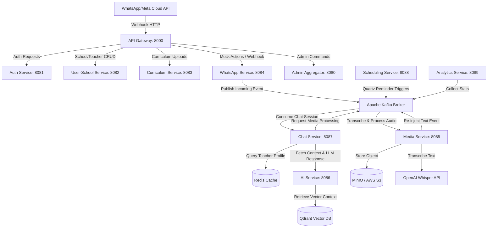

# Nipun Chatbot: Enterprise WhatsApp AI Teaching Assistant Platform

Nipun Chatbot is an enterprise-grade, multi-tenant microservices platform that empowers school teachers with a WhatsApp-based AI Teaching Assistant. The platform features schema-per-school data isolation, Retrieval-Augmented Generation (RAG) powered by LangChain4j & Qdrant, asynchronous audio/media transcription via OpenAI Whisper, and automated scheduling via Quartz.

---

## 💻 Technical Architecture

The platform uses a distributed microservices design coordinated via **Spring Cloud Gateway**, **Apache Kafka**, and **Redis**. 



---

## 📁 Project Modules Directory

The workspace is organized as a multi-module Maven project:

* **[shared-kernel](file:///e:/nipun%20chatbot/shared-kernel)**: Shared library containing filters, schema-based multi-tenancy resolvers, Kafka configs, exception handlers, JWT utilities, and common domain events.
* **[gateway-service](file:///e:/nipun%20chatbot/gateway-service)**: Spring Cloud API Gateway managing routing, paths, and port redirections.
* **[auth-service](file:///e:/nipun%20chatbot/auth-service)**: Handles user credentials, password encoding, and JWT generation.
* **[user-school-service](file:///e:/nipun%20chatbot/user-school-service)**: Manages metadata catalog files for schools (tenants), subjects, and teachers.
* **[whatsapp-service](file:///e:/nipun%20chatbot/whatsapp-service)**: Integrates with Meta's Graph API for incoming/outgoing WhatsApp messages. Includes a Mock Controller for sandbox runs.
* **[chat-service](file:///e:/nipun%20chatbot/chat-service)**: Orchestrates active chat sessions, caches profiles in Redis, handles event routing, and manages database message logs.
* **[ai-service](file:///e:/nipun%20chatbot/ai-service)**: RAG processor utilizing LangChain4j, OpenAI embeddings, and Qdrant to filter data strictly by tenant boundaries.
* **[media-service](file:///e:/nipun%20chatbot/media-service)**: Async processing of image/document uploads and Whisper-based voice note transcriptions.
* **[scheduling-service](file:///e:/nipun%20chatbot/scheduling-service)**: Quartz Scheduler that pushes customized weekly curriculum guides directly to teachers' phones.
* **[analytics-service](file:///e:/nipun%20chatbot/analytics-service)**: Gathers message transactions and processes dashboard metrics.
* **[admin-service](file:///e:/nipun%20chatbot/admin-service)**: Proxy aggregator for Super Admins and School Admins to register schools, catalog curricula, and schedule alerts.

---

## 🚪 Microservice Port Registry

| Microservice | Default Port | Internal Context / Root URL |
| :--- | :--- | :--- |
| **`gateway-service`** | `8000` | Gateway router API prefix |
| **`admin-service`** | `8080` | `/api/admin` (Gateway endpoints) |
| **`auth-service`** | `8081` | `/api/auth` |
| **`user-school-service`**| `8082` | `/api/schools`, `/api/teachers` |
| **`curriculum-service`** | `8083` | `/api/curriculum` |
| **`whatsapp-service`** | `8084` | `/api/whatsapp` |
| **`media-service`** | `8085` | `/api/media` |
| **`ai-service`** | `8086` | `/api/ai` |
| **`chat-service`** | `8087` | `/api/chat` |
| **`scheduling-service`** | `8088` | `/api/schedules` |
| **`analytics-service`** | `8089` | `/api/analytics` |

---

## 🔒 Multi-Tenant Database Strategy

The platform implements **Schema-per-Tenant** isolation for transactional privacy:
- Global metadata (such as School registration, which maps a unique school code to a DB schema) is stored in the `public` schema.
- Dynamic connections are intercepted via `TenantServletFilter` (Web MVC) or `TenantWebFilter` (Reactive).
- When a request specifies `X-Tenant-ID` (or is mapped from an active JWT token), the thread-bound `TenantContext` is set.
- Hibernate's `MultiTenantConnectionProvider` automatically issues an `ALTER SCHEMA` or `SET SCHEMA` statement to isolate all standard JPA repository queries inside the school's private database schema.

---

## 🛠️ Local Development Setup

### 1. Prerequisites
- **Java**: JDK 21 or higher
- **Docker**: Desktop or CLI Engine
- **Maven**: 3.8+ installed in path

### 2. Launch Local Runtimes
Start the database, queue, cache, and vector store dependencies using docker-compose:
```bash
docker-compose up -d
```
This spins up:
- **PostgreSQL** (`localhost:5432`): Transaction logs and multi-tenant schemas.
- **Redis** (`localhost:6379`): Teacher profiles caching.
- **Qdrant** (`localhost:6333`): Vector database.
- **Kafka** (`localhost:9092`): Message streams.

### 3. Compile the Parent POM
Compile the source code:
```bash
mvn clean compile
```

### 4. Set Environment Configuration
Expose your API keys in your environment shell or service configuration:
```env
OPENAI_API_KEY=your_openai_api_key_here
AWS_ACCESS_KEY_ID=mock-key
AWS_SECRET_ACCESS_KEY=mock-secret
```

### 5. Running and Testing
Boot up the individual services from your IDE or using the Spring Boot plugin:
```bash
# Example to run Auth Service
mvn -pl auth-service spring-boot:run
```
To test incoming messages locally, you can use the WhatsApp Mock Controller endpoint:
```http
POST http://localhost:8000/api/whatsapp/mock/trigger?fromPhone=919999999999&type=TEXT&text=Explain+Week+1+Mathematics+activities
```
Check the outbound mock gateway list to verify the AI assistant's generated response:
```http
GET http://localhost:8000/api/whatsapp/mock/outbox
```
